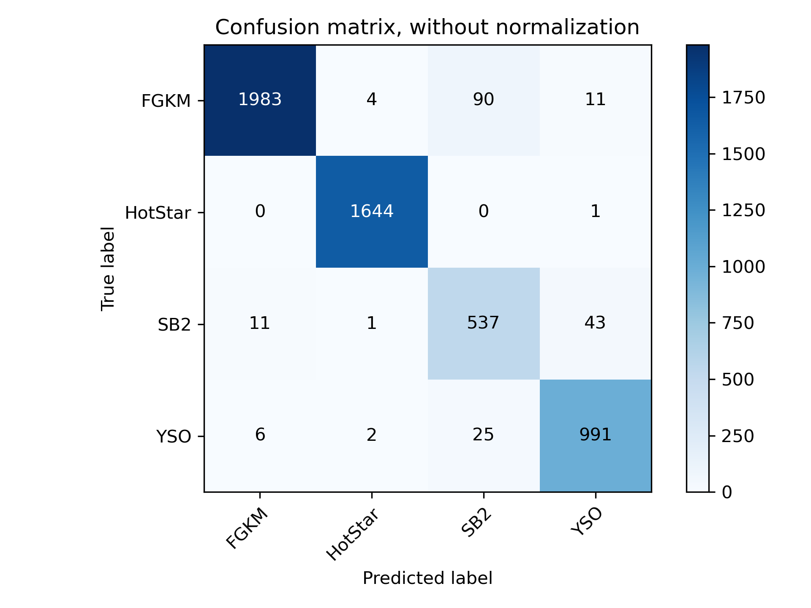

.. title:: Components

.. role:: header_no_toc
  :class: class_header_no_toc

.. title:: Components

:tocdepth: 1

.. rubric:: :header_no_toc:`Components`

Astra includes many external analysis methods as contributed components.
Many of these components include bespoke analysis methods for specialised types of stars.
Below you can find a summary of what components are currently available to run on 
APOGEE or BOSS spectra. In all cases a component *could* be executed on both APOGEE or
BOSS spectra, but we do not have the current models (e.g., spectral grids) to do so.

.. list-table::
    :widths: 50 25 25
    :header-rows: 1

    * - Component
      - APOGEE
      - BOSS
    * - `APOGEENet`_
      - YES
      - NO
    * - `Classifier`_
      - YES
      - YES
    * - `FERRE`_
      - YES
      - NO
    * - `Hot star code`_
      - YES
      - NO
    * - `The Cannon`_
      - YES
      - YES
    * - `The Payne`_
      - YES
      - NO
    * - `WD code`_
      - NO
      - YES

If you are interested in the current functionality of these components, or components
that are planned for integration into Astra, see the `roadmap <roadmap.html>`_.

APOGEENet
=========

**Contributor:** Marina Kounkel (University of Michigan) and collaborators.

APOGEENet uses a neural network to estimate stellar properties of young stellar objects
observed with the APOGEE instrument.
At the time of writing, only the pre-trained neural network for APOGEENet is available.
That means that there are no Astra tasks to train a new neural network.

The most relevant tasks for APOGEENet in Astra are:

- :py:mod:`astra.contrib.apogeenet.tasks.EstimateStellarParametersGivenApStarFile`
- :py:mod:`astra.contrib.apogeenet.tasks.EstimateStellarParameters`

`EstimateStellarParametersGivenApStarFile` will estimate stellar parameters given some
APOGEENet model and an `ApStarFile` object. 
The `EstimateStellarParametersGivenApStarFile` class is a sub-class of the 
`EstimateStellarParameters` class (see below), which is a base task that does not specify what kind
of APOGEE product to expect.

.. inheritance-diagram:: astra.contrib.apogeenet.tasks.EstimateStellarParametersGivenApStarFile
    :top-classes: astra.tasks.base.BaseTask
    :caption: Inheritance diagram for `EstimateStellarParametersGivenApStarFile`.

The only required parameter for `EstimateStellarParameters` is `model_path`: the location
of a file that has the neural network coefficients stored.
The `EstimateStellarParametersGivenApStarFile` task requires the `model_path` parameter,
and any parameters required by `ApStarFile`.

The `EstimateStellarParametersGivenApStarFile` task is `batchable <batch.html>`_: you can analyse many APOGEE observations at once,
minimising the computational overhead in loading the model. 

Workflow
--------

Here we will run APOGEENet on a small sample of well-studied young stellar objects to test that things are working correctly.
The files we will need for this example are:

- `APOGEE_Net.pt <https://drive.google.com/file/d/1ROh3LCwTeKl2V7u7ZIt6NB521U7ntdud/view?usp=sharing>`_: the pre-trained APOGEENet network coefficients

- `astra-yso-test.fits <https://drive.google.com/file/d/1X01hkkBFPLz4tvCqlRbuFW-f36uNPlKt/view?usp=sharing>`_: a table of young stellar objects observed by SDSS and their properties

The code to run the analysis is relatively straightforward::

    import os
    from astropy.table import Table
    import astra
    from astra.contrib.apogeenet.tasks import (
        TrainedAPOGEENetModel, 
        EstimateStellarParametersGivenApStarFile
    )

    component_data_dir = "../astra-components/astra_apogeenet/data/"

    # Common keywords for all analyses.
    kwds = dict(
        release="dr16",
        model_path=os.path.join(component_data_dir, "APOGEE_NET.pt"),
        # Download the file from the SDSS SAS if we don't have it.
        use_remote=True
    )

    # Load the sources.
    sources = Table.read(os.path.join(component_data_dir, "astra-yso-test.fits"))

    # Here we could create one task per source, but it is slightly
    # faster for us to explicitly tell astra to run all sources in
    # batch mode.
    source_keys = ("apstar", "apred", "field", "prefix", "telescope", "obj")
    for key in source_keys:
        kwds.setdefault(key, [])

    for source in sources:
        for key in source_keys:
            kwds[key].append(source[key])

    task = EstimateStellarParametersGivenApStarFile(**kwds)

    # Build the acyclic graph and execute tasks as required.
    astra.build(
        [task],
        local_scheduler=True
    )

This will run APOGEENet on ~5,000 `ApStarFile` spectra in batch mode. 
Now let's see how the results compare to what we expect for these stars::

    # Let's make a plot comparing the outputs to what we expected.
    param_names = ("Teff", "Logg", "FeH")
    N, P = shape = (len(sources), 3) # three parameters estimated.

    X = np.empty(shape)
    X_err = np.empty(shape)
    Y = np.empty(shape)
    Y_err = np.empty(shape)

    for i, (source, output) in enumerate(zip(sources, task.output())):

        X[i] = [source[f"apogeenet-mean_{pn}" for pn in param_names]
        X_err[i] = [source[f"apogeenet-sd_{pn}" for pn in param_names]]

        with open(output.path, "r") as fp:
            result = yaml.load(fp, Loader=yaml.FullLoader)
        
        Y[i] = [result[pn.lower()] for pn in ("teff", "logg", "fe_h")]
        Y_err[i] = [result[f"u_{pn}"] for pn in ("teff", "logg", "fe_h")]

    # Plot the results.
    import matplotlib.pyplot as plt

    label_names = ("teff", "logg", "fe_h")
    fig, axes = plt.subplots(1, 3, figsize=(12, 4))
    for i, ax in enumerate(axes):

        residual = X[:, i] - Y[:, i]

        ax.errorbar(
            X[:, i],
            Y[:, i],
            xerr=X_err[:, i],
            yerr=Y_err[:, i],
            fmt="o",
            c="#000000",
            markersize=5,
            linewidth=1
        )

        mu, std = (np.nanmean(residual), np.nanstd(residual))
        ax.set_title(f"{label_names[i]}: ({mu:.2f}, {std:.2f})")

        limits = np.array([
            ax.get_xlim(),
            ax.get_ylim()
        ])
        limits = (np.min(limits), np.max(limits))
        ax.plot(
            limits,
            limits,
            c="#666666",
            ls=":",
            zorder=-1
        )
        ax.set_xlim(limits)
        ax.set_ylim(limits)

    fig.tight_layout()

If all goes to plan then you should see something like this:

.. figure:: _static/images/workflow_apogeenet_results.png
  :align: center
  :alt: The expected stellar parameters (x-axis) for young stellar objects compared to the results obtained by APOGEENet in Astra (y-axis). The mean and standard deviation of label residuals is shown.

API
---

.. toctree:: api/astra/contrib/apogeenet/model/index
   :maxdepth: 2
   :titlesonly:

.. toctree:: api/astra/contrib/apogeenet/tasks/index
   :maxdepth: 2
   :titlesonly:

Classifier
==========

**Contributor:** Gabriella Contardo (Flatiron Institute)

This component uses a deep convolutional neural network with drop-out to classify sources
by their spectral type. 
Training sets for APOGEE/apVisit and BOSS/spec spectra were coordinated by David Nidever.

The most relevant tasks for this classifier are:

- :py:mod:`astra.contrib.classifier.tasks.train.TrainNIRSpectrumClassifier`
- :py:mod:`astra.contrib.classifier.tasks.train.TrainOpticalSpectrumClassifier`
- :py:mod:`astra.contrib.classifier.tasks.test.ClassifySource`
- :py:mod:`astra.contrib.classifier.tasks.test.ClassifySourceGivenApVisitFile`
- :py:mod:`astra.contrib.classifier.tasks.test.ClassifySourceGivenSpecFile`

All classifier tasks inherit from :py:mod:`astra.contrib.classifier.mixin.ClassifierMixin` and require
the following parameters:

- `training_spectra_path`: A path that contains the spectra for the training set.
    
- `training_set_labels`: A path that contains the labels for the training set.

- `validation_spectra_path`: A path that contains the spectra for the validation set.

- `validation_labels_path`: A path that contains the labels for the validation set.

- `test_spectra_path`: A path that contains the spectra for the test set.
    
- `test_labels_path`: A path that contains ths labels for the test set.

- `class_names`: A tuple of names for the object classes.
    
- `n_epochs`: The number of epochs to use for training (default: 200).
    
- `batch_size`: The number of objects to use per batch in training (default: 100).
    
- `weight_decay`: The weight decay to use during training (default: 1e-5).
    
- `learning_rate`: The learning rate to use during training (default: 1e-4).

The `ClassifySourceGivenApVisitFile` task will also require all the parameters needed by `ApVisitFile`
to identify the location of the observation.

.. inheritance-diagram:: astra.contrib.classifier.tasks.test.ClassifySourceGivenApVisitFile
    :top-classes: astra.tasks.base.BaseTask
    :caption: Inheritance diagram for `ClassifySourceGivenApVisitFile`.

The training, validation, and test set for these networks are `available for download <https://drive.google.com/drive/folders/1b4HNfOrPxJsJFvaqyX3lZ5-HZH9HD2Xc?usp=sharing>`_.

Note that all classifier tasks (e.g., `ClassifySourceGivenApVisitFile`) are `batchable <batch.html>`_: 
you can analyse many observations at once, minimising the computational overhead in loading the neural network. 

Workflow
--------

In this workflow example we will train a near-infrared classifer and use it to classify sources from data release 16::

  import astra
  from astra.tasks.io import AllVisitSum
  from astra.contrib.classifier.tasks.test import ClassifySourceGivenApVisitFile

  from astropy.table import Table
  from collections import defaultdict
  from tqdm import tqdm

  # Load the DR16 AllVisit file to get the parameters we need to locate ApVisit files.
  # Notes: In future we will do this from a SQL query.
  #        If you don't have the AllVisitSum file then you can use this to get it:
  #           
  #          AllVisitSum(release=release, apred=apred, use_remote=True).run()

  release, apred = ("dr16", "r12")
  all_visits = Table.read(AllVisitSum(release=release, apred=apred).local_path)

  def get_kwds(row):
      """
      Return the ApVisit keys we need from a row in the AllVisitSum file.
      """
      return dict(
          telescope=row["TELESCOPE"],
          field=row["FIELD"].lstrip(),
          plate=row["PLATE"].lstrip(),
          mjd=str(row["MJD"]),
          prefix=row["FILE"][:2],
          fiber=str(row["FIBERID"]),
          apred=apred
      )

  # We will run this in batch mode.
  # (We could hard-code keys but it's good coding practice to have a single place of truth)
  apvisit_kwds = { key: [] for key in get_kwds(defaultdict(lambda: "")).keys() }

  # Add all visits to the keywords.
  N_max = None # Use this to set a maximum number of ApVisits to analyse.
  for i, row in tqdm(enumerate(all_visits, start=1)):
      if N_max is not None and i >= N_max: break
      for k, v in get_kwds(row).items():
          apvisit_kwds[k].append(v)

  # Keywords that are needed to train the NIR classifier.
  directory = "../astra-components/astra_classifier/data"
  common_kwds = dict(
      release=release,
      training_spectra_path=f"{directory}/nir/nir_clean_spectra_shfl.npy",
      training_labels_path=f"{directory}/nir/nir_clean_labels_shfl.npy",
      validation_spectra_path=f"{directory}/nir/nir_clean_spectra_valid_shfl.npy",
      validation_labels_path=f"{directory}/nir/nir_clean_labels_valid_shfl.npy",
      test_spectra_path=f"{directory}/nir/nir_clean_spectra_test_shfl.npy",
      test_labels_path=f"{directory}/nir/nir_clean_labels_test_shfl.npy",
      class_names=["FGKM", "HotStar", "SB2", "YSO"]
  )

  # Merge keywords and create task.
  task = ClassifySourceGivenApVisitFile(**{ **common_kwds, **apvisit_kwds })

  # Get Astra to build the acyclic graph and schedule tasks.
  astra.build(
      [task],
      local_scheduler=True
  )

Astra will build the acyclic graph, and if you haven't previously trained a classifier using these parameters, then it will train one before classifying sources.

For every `ApVisitFile` the classifier will estimate the probability that the source belongs to each of the classes. This is not really a probability, but is usually taken as one. 
You can take the class with the highest probability as being the 'predicted class', or trigger tasks to occur if the probability of belonging to a particular class is higher than some value.

One of the outputs produced from training the network is a confusion matrix showing how frequently the classifier accurately classified sources in the test set.

    Unnormalized confusion matrix for the near-infrared test set.
  
This confusion matrix is based on the _test set_, not the training set used to train the model.
You can see that in general the classifier is doing very well and predicting the correct class almost every time.

API
---

.. toctree:: api/astra/contrib/classifier/index
   :maxdepth: 4
   :titlesonly:

FERRE
=====

**Contributors:** Carlos Allende-Prieto (Instituto de Astrofisica de Canarias), Jon Holtzman (New Mexico State University), and others

FERRE is a code to interpolate pre-computed grids of model spectra and compare with
observations.
The best-fitting model spectrum by chi-squared minimisation, with a few optimisation
algorithms available.
FERRE was used (as part of ASPCAP) for the APOGEE analysis of SDSS-IV data. 
Astra has tasks that reproduce the functionality of ASPCAP, but this functionality all exists within the `astra.contrib.ferre` module.

The most relevant tasks for running FERRE (or reproducing ASPCAP functionality) are:

- :py:mod:`astra.contrib.ferre.tasks.ferre.EstimateStellarParametersGivenApStarFile`
- :py:mod:`astra.contrib.ferre.tasks.aspcap.IterativeEstimateOfStellarParametersGivenApStarFile`
- :py:mod:`astra.contrib.ferre.tasks.aspcap.EstimateStellarParametersGivenMedianFilteredApStarFile`
- :py:mod:`astra.contrib.ferre.tasks.aspcap.ASPCAPDispatchFerreTasksGivenApStarFile`
- :py:mod:`astra.contrib.ferre.tasks.aspcap.DispatchFerreTasksGivenApStarFile`

Let's go through how to run FERRE on it's own before we talk about reproducing ASPCAP functionality.

If you want to run FERRE on it's own the relevant task is :py:mod:`astra.contrib.ferre.tasks.ferre.EstimateStellarParametersGivenApStarFile`.
This task requires many parameters: analysis parameters (e.g., interpolation order); model grid parameters (e.g., isotopes used or model photospheres); and those required to locate an `ApStarFile`.

# TODO: List all parameters.

You can reproduce ASPCAP functionality by calling FERRE multiple times

API
---

.. toctree: api/astra/contrib/ferre/index
    :maxdepth: 2

Hot star code
=============
**Contributors:** Ilya Straumit (KU Leuven)

The Cannon
==========

**Contributors:** Melissa Ness (Columbia University; Flatiron Institute), Andy Casey (Monash), and others

The Cannon :cite:`2015ApJ16N` is a data-driven method to estimate stellar labels 
(e.g., effective temperature, surface gravity, and chemical abundances).
A training set of stars with high-fidelity labels is required to train a model
to predict stellar spectra. 

If you want to use The Cannon as a task in Astra then the most relevant classes are:

- :py:mod:`astra.contrib.thecannon.tasks.train.TrainTheCannon`
- :py:mod:`astra.contrib.thecannon.tasks.test.TestTheCannon`

If you want to use The Cannon without Astra then the most relevant class is:

- :py:mod:`astra.contrib.thecannon.CannonModel`

Train The Cannon using a pre-prepared training set
--------------------------------------------------

You can train The Cannon in Astra using a `pickle` file that contains the training set.
The training set file should contain a dictionary with the following entries:    
    - `wavelength`: an array of shape `(P, )` where `P` is the number of pixels
    - `flux`: an array of flux values with shape `(N, P)` where `N` is the number of observed spectra and `P` is the number of pixels
    - `ivar`: an array of inverse variance values with shape `(N, P)` where `N` is the number of observed spectra and `P` is the number of pixels
    - `labels`: an array of shape `(L, N)` where `L` is the number of labels and `N` is the number observed spectra
    - `label_names`: a tuple of length `L` that describes the names of the labels

Once you have created this file you can supply the path of the training set to the
:py:mod:`astra.contrib.thecannon.tasks.train.TrainTheCannon` task.

Train The Cannon using SDSS spectra and labels
----------------------------------------------

See the workflow file.

.. inheritance-diagram::  astra.contrib.thecannon.tasks.train.TrainTheCannon
    :top-classes: astra.tasks.base.BaseTask
    :parts: 2

Testing The Cannon
------------------

You can estimate stellar labels given some spectra and a trained model using the
:py:mod:`astra.contrib.thecannon.tasks.test.TestTheCannon` task. However, this task
has no hard-coded information about what kind of observation to expect (e.g., APOGEE
or BOSS). That means you need to sub-class this task and inherit the behaviour from
the kind of spectra you would like to use The Cannon on.

For example, if you wanted to train The Cannon on APOGEE apVisit specra, you would
sub-class the `TestTheCannon` task like this::

    import astra
    from astra.tasks.io import ApStarFile
    from astra.contrib.thecannon.tasks.train import TrainTheCannon
    from astra.contrib.thecannon.tasks.test import TestTheCannon

    @astra.inherits(TrainTheCannon, ApStarFile)
    class StellarParameters(TestTheCannon):

        """
        A task to estimate stellar parameters, given an ApStar file and The Cannon.
        """

        def requires(self):
            return {
                "model": TrainTheCannon(**self.get_common_param_kwargs(TrainTheCannon)),
                "observation": ApStarFile(**self.get_common_param_kwargs(ApStarFile))
            }

Now our `StellarParameters` task will know how to load ApStar spectra.

API
---

.. toctree:: api/astra/contrib/thecannon/index
   :maxdepth: 2
   :titlesonly:

.. toctree:: api/astra/contrib/thecannon/tasks/index
   :maxdepth: 2
   :titlesonly:

The Payne
=========

**Contributors:** Yuan-Sen Ting (Australian National University)

The Payne is a name given for a single-layer neural network trained on model spectra to estimate stellar properties.

If you want to use The Payne then the most relevant tasks in Astra are:

- :py:mod:`astra.contrib.thepayne.tasks.TrainThePayne`
- :py:mod:`astra.contrib.thepayne.tasks.EstimateStellarParameters`
- :py:mod:`astra.contrib.thepayne.tasks.EstimateStellarParametersGivenApStarFile`

The only required parameter for `TrainThePayne` is `training_set_path`: the location
of a file that has the neural network coefficients stored.
This should be a pickle file that stores a dictionary with the following keys:

- wavelength: an array of shape (P, ) where P is the number of pixels
- spectra: an array of shape (N, P) where N is the number of spectra and P is the number of pixels
- labels: an array of shape (L, P) where L is the number of labels and P is the number of pixels
- label_names: a tuple of length L that contains the names of the labels

`EstimateStellarParametersGivenApStarFile` will estimate stellar parameters given some
pre-trained neural network (trained by `TrainThePayne`) and an `ApStarFile` object. 
The `EstimateStellarParametersGivenApStarFile` class is a sub-class of the 
`EstimateStellarParameters` class (see below), which is a base task that does not specify what kind
of observation.

.. inheritance-diagram:: astra.contrib.thepayne.tasks.EstimateStellarParametersGivenApStarFile
    :top-classes: astra.tasks.base.BaseTask
    :caption: Inheritance diagram for `EstimateStellarParametersGivenApStarFile`.

Workflow
--------

By default, no continuum normalisation is performed by the `EstimateStellarParametersGivenApStarFile` task.
Here we will change that and define our own continuum normalisation behaviour.

The files you will need for this workflow are:

- `kurucz_data.pkl <https://drive.google.com/file/d/1RfhkyZBKY3he6sTSM67KPQfVfMnIg_cs/view?usp=sharing>`_: a pre-computed grid of synthetic spectra to train the network
- `continuum-regions.list <https://drive.google.com/file/d/1RqHxy6t9mCHkPYFH2HEMjHxFCachv-2h/view?usp=sharing>`_: a list of continuum regions for APOGEE spectra, provided by Melissa Ness (Columbia University)

Now let's look at the code::

  import astra
  from astra.tasks.continuum import Sinusoidal
  from astra.tasks.io import ApStarFile
  from astra.contrib.thepayne.tasks import (
      EstimateStellarParametersGivenApStarFile, 
      TrainThePayne
  )

  # Let's define a continuum normalization task for ApStarFiles using a sum of sines
  # and cosines.
  class ContinuumNormalize(Sinusoidal, ApStarFile):
      
      # Just take the first spectrum, which is stacked by individual pixel weighting.
      # (We will ignore individual visits).
      spectrum_kwds = dict(data_slice=(slice(0, 1), slice(None)))

      def requires(self):
          return ApStarFile(**self.get_common_param_kwargs(ApStarFile))
      

  # The EstimateStellarParametersGivenApStarFile task performs no continuum normalisation.
  # Here we will create a new class that requires that the observations are continuum normalised.
  class EstimateStellarParameters(EstimateStellarParametersGivenApStarFile, ContinuumNormalize):

      def requires(self):
          requirements = dict(model=TrainThePayne(**self.get_common_param_kwargs(TrainThePayne)))
          if not self.is_batch_mode:
              requirements.update(
                  observation=ContinuumNormalize(**self.get_common_param_kwargs(ContinuumNormalize))
              )
          return requirements

  # Let's run on one star first.
  kwds = dict(
      training_set_path="kurucz_data.pkl",
      continuum_regions_path="continuum-regions.list",

      # ApStar keywords:
      release="dr16",
      apred="r12",
      apstar="stars",
      telescope="apo25m",
      field="000+14",
      prefix="ap",
      obj="2M16505794-2118004",
      use_remote=True # Download the apStar file if we don't have it.

  )

  # Create the task.
  task = EstimateStellarParameters(**kwds)

  # Build the acyclic graph and execute tasks as necessary.
  astra.build(
      [task],
      local_scheduler=True
  )

The first time you run this workflow it will train a neural network, download the `ApStarFile` (if it does not exist already), perform continuum normalisation, and then estimate stellar parameters given the trained neural network and the psuedo-continuum-normalised spectrum.

The `EstimateStellarParametersGivenApStarFile` task is `batchable <batch.html>`_: you can analyse many observations at once,
minimising the computational overhead in loading the network. 

API
---

.. toctree:: api/astra/contrib/thepayne/index
   :maxdepth: 2
   :titlesonly:

WD code
=======

**Contributors:** Nicola Gentile Fusillo (European Southern Observatory)

This code classifies white dwarfs given line depths of strong absorption lines, and fits model spectra directly to observations for DA-type white dwarfs.

If you want to use this white dwarf analysis code in Astra then the most relevant tasks are:

- :py:mod:`astra.contrib.wd.tasks.classify.ClassifyWhiteDwarfGivenSpecFile`

The only required parameters for `ClassifyWhiteDwarfGivenSpecFile` is the `model_path`,
which is the location of a pre-trained random forest classifier, 
and the parameters required to locate the `SpecFile`.

.. inheritance-diagram:: astra.contrib.wd.tasks.classify.ClassifyWhiteDwarfGivenSpecFile
    :top-classes: astra.tasks.base.BaseTask
    :caption: Inheritance diagram for `ClassifyWhiteDwarfGivenSpecFile`.

Workflow
--------

To run this workflow you will need the following files:
- `training_file <>`_: a random forest classifier trained using the default line region settings
- `wd-class-examples.yml <>`_: a file containing SpecFile keywords and known classes of white dwarfs

Here we will use the sample of known WDs observed in SDSS-IV, and the pre-trained random forest classifier, to classify known WDs and compare the predicted class to the expected class::

    import astra
    import numpy as np
    import os
    import yaml
    from astra.contrib.wd.tasks.classify import ClassifyWhiteDwarfGivenSpecFile

    directory = "../astra-components/data/wd/"

    # Get the expected classes for 
    with open(os.path.join(directory, "sdss-wd-examples.yml"), "r") as fp:
        examples = yaml.load(fp, Loader=yaml.FullLoader)

    # Let's separate the expected classes and join the keywords together.
    N = 100 # Optionally only do a subset of the data.
    kwds = { key: [] for key in examples[0].keys() }
    for i, each in enumerate(examples, start=1):
        if N is not None and i >= N: break
        for k, v in each.items():
            kwds[k].append(v)

    expected_classes = kwds.pop("expected_class")
    kwds.update(
        release="dr16",
        model_path=os.path.join(directory, "training_file")
    )

    # Create the task where we will run everything in batch mode.
    task = ClassifyWhiteDwarfGivenSpecFile(**kwds)

    # Build the acyclic graph and execute tasks.
    astra.build(
        [task],
        local_scheduler=True
    )

  Now let's make a confusion matrix plot to see how well the classifier performed::

    import pickle

    predicted_classes = []
    for output in task.output():
        with open(output.path, "rb") as fp:
            result = pickle.load(fp)
        predicted_classes.append(result["wd_class"])

    # Let's plot a confusion matrix.

    # Restrict to major classes only.
    max_chars = 2
    unique_class_names = sorted(set([pc[:max_chars] for pc in predicted_classes]))

    M = len(unique_class_names)
    confusion_matrix = np.zeros((M, M))
    for i, (predicted_class, expected_class) in enumerate(zip(predicted_classes, expected_classes)):
        j = unique_class_names.index(expected_class.upper())
        k = unique_class_names.index(predicted_class.upper()[:max_chars])
        confusion_matrix[j, k] += 1

API
---

.. toctree:: api/astra/contrib/wd/index
    :maxdepth: 2
    :titlesonly:

.. bibliography:: refs.bib
   :style: unsrt