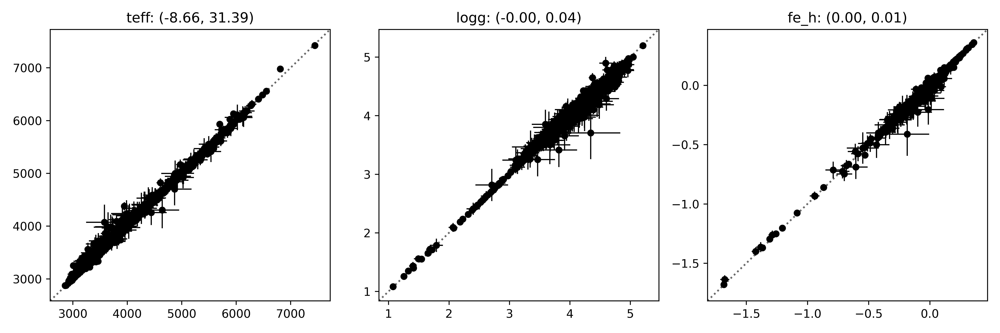

.. title:: Components

.. role:: header_no_toc
  :class: class_header_no_toc

.. title:: Components

:tocdepth: 1

.. rubric:: :header_no_toc:`Components`

Astra includes many external analysis methods as contributed components.
Many of these components include bespoke analysis methods for specialised types of stars.
Below you can find a summary of what components are currently available to run on 
APOGEE or BOSS spectra. In all cases a component *could* be executed on both APOGEE or
BOSS spectra, but we do not have the current models (e.g., spectral grids) to do so.

.. list-table::
    :widths: 50 25 25
    :header-rows: 1

    * - Component
      - APOGEE
      - BOSS
    * - `APOGEENet`_
      - YES
      - NO
    * - `Classifier`_
      - YES
      - YES
    * - `FERRE`_
      - YES
      - NO
    * - `Hot star code`_
      - YES
      - NO
    * - `The Cannon`_
      - YES
      - YES
    * - `The Payne`_
      - YES
      - NO
    * - `WD code`_
      - NO
      - YES

If you are interested in the current functionality of these components, or components
that are planned for integration into Astra, see the `roadmap <roadmap.html>`_.

APOGEENet
=========

**Contributor:** Marina Kounkel (University of Michigan) and collaborators.

APOGEENet uses a neural network to estimate stellar properties of young stellar objects
observed with the APOGEE instrument.
At the time of writing, only the pre-trained neural network for APOGEENet is available.
That means that there are no Astra tasks to train a new neural network.

The most relevant tasks for APOGEENet in Astra are:

- :py:mod:`astra.contrib.apogeenet.tasks.EstimateStellarParametersGivenApStarFile`
- :py:mod:`astra.contrib.apogeenet.tasks.EstimateStellarParameters`

`EstimateStellarParametersGivenApStarFile` will estimate stellar parameters given some
APOGEENet model and an `ApStarFile` object. 
The `EstimateStellarParametersGivenApStarFile` class is a sub-class of the 
`EstimateStellarParameters` class (see below), which is a base task that does not specify what kind
of APOGEE product to expect.

.. inheritance-diagram:: astra.contrib.apogeenet.tasks.EstimateStellarParametersGivenApStarFile
    :top-classes: astra.tasks.base.BaseTask
    :caption: Inheritance diagram for `EstimateStellarParametersGivenApStarFile`.

The only required parameter for `EstimateStellarParameters` is `model_path`: the location
of a file that has the neural network coefficients stored.
The `EstimateStellarParametersGivenApStarFile` task requires the `model_path` parameter,
and any parameters required by `ApStarFile`.

The `EstimateStellarParametersGivenApStarFile` task is `batchable <batch.html>`_: you can analyse many APOGEE observations at once,
minimising the computational overhead in loading the model. 

Workflow
--------

Here we will run APOGEENet on a small sample of well-studied young stellar objects to test that things are working correctly.
The files we will need for this example are:

- `APOGEE_Net.pt <https://drive.google.com/file/d/1ROh3LCwTeKl2V7u7ZIt6NB521U7ntdud/view?usp=sharing>`_: the pre-trained APOGEENet network coefficients

- `astra-yso-test.fits <https://drive.google.com/file/d/1X01hkkBFPLz4tvCqlRbuFW-f36uNPlKt/view?usp=sharing>`_: a table of young stellar objects observed by SDSS and their properties

The code to run the analysis is relatively straightforward::

    import os
    from astropy.table import Table
    import astra
    from astra.contrib.apogeenet.tasks import (
        TrainedAPOGEENetModel, 
        EstimateStellarParametersGivenApStarFile
    )

    component_data_dir = "../astra-components/astra_apogeenet/data/"

    # Common keywords for all analyses.
    kwds = dict(
        release="dr16",
        model_path=os.path.join(component_data_dir, "APOGEE_NET.pt"),
        # Download the file from the SDSS SAS if we don't have it.
        use_remote=True
    )

    # Load the sources.
    sources = Table.read(os.path.join(component_data_dir, "astra-yso-test.fits"))

    # Here we could create one task per source, but it is slightly
    # faster for us to explicitly tell astra to run all sources in
    # batch mode.
    source_keys = ("apstar", "apred", "field", "prefix", "telescope", "obj")
    for key in source_keys:
        kwds.setdefault(key, [])

    for source in sources:
        for key in source_keys:
            kwds[key].append(source[key])

    task = EstimateStellarParametersGivenApStarFile(**kwds)

    # Build the acyclic graph and execute tasks as required.
    astra.build(
        [task],
        local_scheduler=True
    )

This will run APOGEENet on ~5,000 `ApStarFile` spectra in batch mode. 
Now let's see how the results compare to what we expect for these stars::

    # Let's make a plot comparing the outputs to what we expected.
    param_names = ("Teff", "Logg", "FeH")
    N, P = shape = (len(sources), 3) # three parameters estimated.

    X = np.empty(shape)
    X_err = np.empty(shape)
    Y = np.empty(shape)
    Y_err = np.empty(shape)

    for i, (source, output) in enumerate(zip(sources, task.output())):

        X[i] = [source[f"apogeenet-mean_{pn}" for pn in param_names]
        X_err[i] = [source[f"apogeenet-sd_{pn}" for pn in param_names]]

        with open(output.path, "r") as fp:
            result = yaml.load(fp, Loader=yaml.FullLoader)
        
        Y[i] = [result[pn.lower()] for pn in ("teff", "logg", "fe_h")]
        Y_err[i] = [result[f"u_{pn}"] for pn in ("teff", "logg", "fe_h")]

    # Plot the results.
    import matplotlib.pyplot as plt

    label_names = ("teff", "logg", "fe_h")
    fig, axes = plt.subplots(1, 3, figsize=(12, 4))
    for i, ax in enumerate(axes):

        residual = X[:, i] - Y[:, i]

        ax.errorbar(
            X[:, i],
            Y[:, i],
            xerr=X_err[:, i],
            yerr=Y_err[:, i],
            fmt="o",
            c="#000000",
            markersize=5,
            linewidth=1
        )

        mu, std = (np.nanmean(residual), np.nanstd(residual))
        ax.set_title(f"{label_names[i]}: ({mu:.2f}, {std:.2f})")

        limits = np.array([
            ax.get_xlim(),
            ax.get_ylim()
        ])
        limits = (np.min(limits), np.max(limits))
        ax.plot(
            limits,
            limits,
            c="#666666",
            ls=":",
            zorder=-1
        )
        ax.set_xlim(limits)
        ax.set_ylim(limits)

    fig.tight_layout()

If all goes to plan then you should see something like this:

API
---

.. toctree:: api/astra/contrib/apogeenet/model/index
   :maxdepth: 2
   :titlesonly:

.. toctree:: api/astra/contrib/apogeenet/tasks/index
   :maxdepth: 2
   :titlesonly:

Classifier
==========

**Contributor:** Gabriella Contardo (Flatiron Institute)

This component uses a deep convolutional neural network with drop-out to classify sources
by their spectral type. 
Training sets for APOGEE/apVisit and BOSS/spec spectra were coordinated by David Nidever.

The most relevant tasks for this classifier are:

- :py:mod:`astra.contrib.classifier.tasks.train.TrainNIRSpectrumClassifier`
- :py:mod:`astra.contrib.classifier.tasks.train.TrainOpticalSpectrumClassifier`
- :py:mod:`astra.contrib.classifier.tasks.test.ClassifySource`
- :py:mod:`astra.contrib.classifier.tasks.test.ClassifySourceGivenApVisitFile`
- :py:mod:`astra.contrib.classifier.tasks.test.ClassifySourceGivenSpecFile`

All classifier tasks inherit from :py:mod:`astra.contrib.classifier.mixin.ClassifierMixin` and require
the following parameters:

- `training_spectra_path`: A path that contains the spectra for the training set.
    
- `training_set_labels`: A path that contains the labels for the training set.

- `validation_spectra_path`: A path that contains the spectra for the validation set.

- `validation_labels_path`: A path that contains the labels for the validation set.

- `test_spectra_path`: A path that contains the spectra for the test set.
    
- `test_labels_path`: A path that contains ths labels for the test set.

- `class_names`: A tuple of names for the object classes.
    
- `n_epochs`: The number of epochs to use for training (default: 200).
    
- `batch_size`: The number of objects to use per batch in training (default: 100).
    
- `weight_decay`: The weight decay to use during training (default: 1e-5).
    
- `learning_rate`: The learning rate to use during training (default: 1e-4).

The `ClassifySourceGivenApVisitFile` task will also require all the parameters needed by `ApVisitFile`
to identify the location of the observation.

.. inheritance-diagram:: astra.contrib.classifier.tasks.test.ClassifySourceGivenApVisitFile
    :top-classes: astra.tasks.base.BaseTask
    :caption: Inheritance diagram for `ClassifySourceGivenApVisitFile`.

The training, validation, and test set for these networks are available for download here:

TODO

Note that all classifier tasks (e.g., `ClassifySourceGivenApVisitFile`) are `batchable <batch.html>`_: 
you can analyse many observations at once, minimising the computational overhead in loading the neural network. 

Workflow
--------

API
---

.. toctree:: api/astra/contrib/classifier/index
   :maxdepth: 4
   :titlesonly:

FERRE
=====

**Contributors:** Carlos Allende-Prieto (Instituto de Astrofisica de Canarias), Jon Holtzman (New Mexico State University), and others

FERRE is a code to interpolate pre-computed grids of model spectra and compare with
observations.
The best-fitting model spectrum by chi-squared minimisation, with a few optimisation
algorithms available.
FERRE was used (as part of ASPCAP) for the APOGEE analysis of SDSS-IV data. 
Astra has tasks that reproduce the functionality of ASPCAP.

API
---

.. toctree: api/astra/contrib/ferre/index
    :maxdepth: 2

Hot star code
=============
**Contributors:** Ilya Straumit (KU Leuven)

The Cannon
==========

**Contributors:** Melissa Ness (Columbia University; Flatiron Institute), Andy Casey (Monash), and others

The Cannon :cite:`2015ApJ16N` is a data-driven method to estimate stellar labels 
(e.g., effective temperature, surface gravity, and chemical abundances).
A training set of stars with high-fidelity labels is required to train a model
to predict stellar spectra. 

If you want to use The Cannon as a task in Astra then the most relevant classes are:

- :py:mod:`astra.contrib.thecannon.tasks.train.TrainTheCannon`
- :py:mod:`astra.contrib.thecannon.tasks.test.TestTheCannon`

If you want to use The Cannon without Astra then the most relevant class is:

- :py:mod:`astra.contrib.thecannon.CannonModel`

Train The Cannon using a pre-prepared training set
--------------------------------------------------

You can train The Cannon in Astra using a `pickle` file that contains the training set.
The training set file should contain a dictionary with the following entries:    
    - `wavelength`: an array of shape `(P, )` where `P` is the number of pixels
    - `flux`: an array of flux values with shape `(N, P)` where `N` is the number of observed spectra and `P` is the number of pixels
    - `ivar`: an array of inverse variance values with shape `(N, P)` where `N` is the number of observed spectra and `P` is the number of pixels
    - `labels`: an array of shape `(L, N)` where `L` is the number of labels and `N` is the number observed spectra
    - `label_names`: a tuple of length `L` that describes the names of the labels

Once you have created this file you can supply the path of the training set to the
:py:mod:`astra.contrib.thecannon.tasks.train.TrainTheCannon` task.

Train The Cannon using SDSS spectra and labels
----------------------------------------------

See the workflow file.

.. inheritance-diagram::  astra.contrib.thecannon.tasks.train.TrainTheCannon
    :top-classes: astra.tasks.base.BaseTask
    :parts: 2

Testing The Cannon
------------------

You can estimate stellar labels given some spectra and a trained model using the
:py:mod:`astra.contrib.thecannon.tasks.test.TestTheCannon` task. However, this task
has no hard-coded information about what kind of observation to expect (e.g., APOGEE
or BOSS). That means you need to sub-class this task and inherit the behaviour from
the kind of spectra you would like to use The Cannon on.

For example, if you wanted to train The Cannon on APOGEE apVisit specra, you would
sub-class the `TestTheCannon` task like this::

    import astra
    from astra.tasks.io import ApStarFile
    from astra.contrib.thecannon.tasks.train import TrainTheCannon
    from astra.contrib.thecannon.tasks.test import TestTheCannon

    @astra.inherits(TrainTheCannon, ApStarFile)
    class StellarParameters(TestTheCannon):

        """
        A task to estimate stellar parameters, given an ApStar file and The Cannon.
        """

        def requires(self):
            return {
                "model": TrainTheCannon(**self.get_common_param_kwargs(TrainTheCannon)),
                "observation": ApStarFile(**self.get_common_param_kwargs(ApStarFile))
            }

Now our `StellarParameters` task will know how to load ApStar spectra.

API
---

.. toctree:: api/astra/contrib/thecannon/index
   :maxdepth: 2
   :titlesonly:

.. toctree:: api/astra/contrib/thecannon/tasks/index
   :maxdepth: 2
   :titlesonly:

The Payne
=========

**Contributors:** Yuan-Sen Ting (Australian National University)

The Payne uses a single-layer neural network trained on model spectra to estimate
stellar properties.

WD code
=======

**Contributors:** Nicola Gentile Fusillo (European Southern Observatory)

.. bibliography:: refs.bib
   :style: unsrt