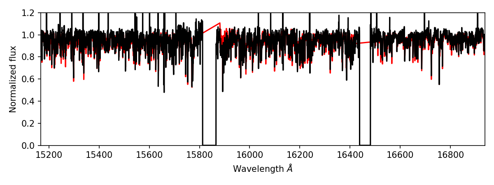

.. _astra-tutorials:

.. role:: header_no_toc
  :class: class_header_no_toc

.. title:: Example workflow for APOGEE spectra

:tocdepth: 3

Example workflow for APOGEE spectra
===================================

Astra uses `Luigi <https://luigi.readthedocs.io/en/stable/>`_ to manage individual tasks and dependencies. In this context a task is an individual step in an analysis pipeline. This might be performing continuum normalisation, or stacking spectra from multiple visits, or running FERRE. Each one of these is a task, and tasks can depend on the output of each other. To create a workflow (or a pipeline) we need to define multiple tasks. All you need to do is define what each task requires, and Astra will deal with the scheduling and execution of tasks in the correct order.

In this tutorial we will create a workflow for executing FERRE on APOGEE spectra. The tasks we are going to need are::

1. Continuum normalise spectra from individual visits, and combine them.

2. Execute FERRE on the combined spectrum.

Each task needs four things to be properly defined:

1. The parameters of that task.

2. A `requires()` function that defines what other tasks it depends on.

3. A `run()` function that executes the task.

4. An `output()` function that defines the output of the task (usually a local file).

You can `read more about Tasks in Astra here <tasks.html>`_, or review the `Luigi documentation <https://luigi.readthedocs.io/en/stable/>`_.

Installation
~~~~~~~~~~~~

This workflow assumes that you have `installed Astra <../install.html>`_, run the initial setup command, and that you have added the FERRE component::

  # Set up Astra
  astra setup

  # Install the Astra component code for FERRE
  # (and optionally install the FERRE code itself with the --install-ferre flag)
  astra component add astra_ferre --install-ferre

Continuum normalisation
~~~~~~~~~~~~~~~~~~~~~~~

There are many ways to perform continuum normalisation, and each method will have different input parameters. Astra contains many utility functions so that you can chose what method of continuum normalisation to perform. That means you can easily specify a new workflow just by specifying a different task. Here is what our continuum normalisation task might look like::

  from astra.tasks.io import ApStarFile
  from astra.tasks.continuum import Sinusoidal

  class ContinuumNormalize(Sinusoidal, ApStarFile):

      sum_axis = 0

      def requires(self):
          return ApStarFile(**self.get_common_param_kwargs(ApStarFile))

Here we are creating a class called `ContinuumNormalize` that extends the behaviour of the `ApStarFile` and `Sinusoidal` classes. The `Sinusoidal` and `ApStarFile` classes already define some of the other things we need for this task (like the parameters needed and the `run()` and `output()` functions). The `ApStarFile` class defines that we will be performing work on a file that follows the `apStar data model <https://data.sdss.org/datamodel/files/>`_, and the `Sinusoidal` class describes the continuum normalisation method (a combination of sine and cosine functions). We need to include both of these classes because the `Sinusoidal` class could be executed with any kind of spectra.

The `Sinusoidal` class has four parameters that we need to define:

- A required `continuum_regions_path` parameter that describes which pixels are considered continuum.
- A `L` (length) parameter that defaults to 1400.
- A `order` parameter that defaults to 3.
- A `sum_axis` parameter that defaults to `None`. If `None`, then the spectrum will not be stacked. If not `None`, it will stack multiple visits along the given axis.

The `Sinusoidal` class already has an `output()` function defined that will save the continuum-normalized spectrum to the same directory as the input path, but you can overwrite this if you want by defining your own `output()` function.

Running FERRE
~~~~~~~~~~~~~

FERRE is a component in Astra, and that means it has a FERRE task already defined that you can use. That task defines the parameters required, the `run()` command that executes FERRE, and the `output()` function. All you need to do is define what kind of data it will execute, and what task is required before FERRE can run::

  from astra_ferre.tasks import Ferre

  class StellarParameters(Ferre, ApStarFile):

      def requires(self):
          return ContinuumNormalize(**self.get_common_param_kwargs(ContinuumNormalize))

Again you can see our task extends the behaviour from the `Ferre` and `ApStarFile` tasks. All we have to do here is define that our `StellarParameters` task requires the `ContinuumNormalize` task to finish first.

Analysing a single star
~~~~~~~~~~~~~~~~~~~~~~~

Let's analyse a single star. To do that we will need to execute a task that has all the parameters we need. We haven't talked about it yet, but the `ApStarFile` task requires a bunch of parameters that define the spectrum to analyse. These parameters are defined by the SDSS data model. For example, for an apStar spectrum we need:

- `apred`: the reduction version (e.g., "r12")
- `apstar`: define the class of object (e.g., "stars")
- `telescope`: the telescope observed with (e.g., "apo25m")
- `field`: the field the star was observed in (e.g., "000+14")
- `prefix`: the prefix for the file (e.g., "ap") -- this exists for legacy reasons
- `obj`: the object name (e.g., "2M16505794-2118004")

Having these parameters will uniquely define an apStar file, and tell us where we can find it on SDSS servers. Now that we've introduced those parameters, let's look at our workflow file in full to analyse a single star::

  from astra.tasks.io import ApStarFile
  from astra.tasks.continuum import Sinusoidal
  from astra_ferre.tasks import Ferre

  class ContinuumNormalize(Sinusoidal, ApStarFile):

      sum_axis = 0

      def requires(self):
          return ApStarFile(**self.get_common_param_kwargs(ApStarFile))

  class StellarParameters(Ferre, ApStarFile):

      def requires(self):
          return ContinuumNormalize(**self.get_common_param_kwargs(ContinuumNormalize))

  if __name__ == "__main__":

      # Let's run our workflow on a single star.
      import luigi

      import matplotlib.pyplot as plt

      # Do single star.
      file_params = dict(
          apred="r12",
          apstar="stars",
          telescope="apo25m",
          field="000+14",
          prefix="ap",
          obj="2M16505794-2118004",
          use_remote=True # Download the apStar file if we don't have it here.
      )

      additional_params = dict(
          initial_teff=5000,
          initial_logg=4.0,
          initial_m_h=0,
          initial_alpha_m=0.0,
          initial_n_m=0.0,
          initial_c_m=0.0,
          synthfile_paths="~/sdss/astra_components/data/ferre/asGK_131216_lsfcombo5v6/p6_apsasGK_131216_lsfcombo5v6_w123.hdr"
      )

      params = {**file_params, **additional_params}

      task = StellarParameters(**params)

      luigi.build(
          [task],
          local_scheduler=True,
          detailed_summary=True
      )

      # Now let's just run the task again and look at the results ourselves.
      spectrum, result = task.run()

      params, params_err, model_flux, meta = result

      fig, ax = plt.subplots(figsize=(8, 3))
      ax.plot(meta["dispersion"][0], model_flux[0], c='r')
      ax.plot(spectrum.wavelength, spectrum.flux[0], c='k')
      ax.set_xlim(*meta["dispersion"][0, [0, -1]])
      ax.set_ylim(0, 1.2)
      ax.set_xlabel(r"Wavelength $\AA$")
      ax.set_ylabel(r"Normalized flux")
      fig.tight_layout()
      plt.show()

To run this successfully you will need a grid of synthetic spectra in the right format for FERRE. This is defined by the `synthfile_paths` parameter. Unfortunately, these synthetic grids do not currently have a SDSS data model specification, so Astra cannot automagically download this file. You can `download the synthfile used in this example <https://dr14.sdss.org/sas/dr12/apogee/spectro/redux/speclib/asset/kurucz_filled/solarisotopes/asGK_131216_lsfcombo5v6/p6_apsasGK_131216_lsfcombo5v6_w123.hdr>`_, but be aware it is from DR12.

After running this you should get a figure that looks something like this:

Analysing many stars
~~~~~~~~~~~~~~~~~~~~

If we wanted to run this pipeline on many stars we would just generate many tasks, where each task specifies the parameters that point to the observed data (and any custom FERRE parameters you want to set on a per-object basis). In practice we can watch a folder for reduced data products and create a `StellarParameters()` task for every observation. Astra won't re-run any tasks that have already been executed, unless there is a change to the input parameters (e.g., specifying a different `initial_teff` would trigger the tasks to re-run). Alternatively we could load in a list of schedduled observations and create tasks for every observation, and then Astra will only execute those tasks once the apStar file exists.
